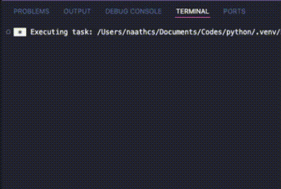

# Dice Rolling
Dice Rolling Game created with Python.

## Table of Content 
- [Overview](#overview)
- [View](#view)
- [Process Breakdown](#process-breakdown)
    - [How to Run](#how-to-run)
- [Links](#links)
- [Author](#author)

## Overview

The user can choose how many dice will be rolled and the program generate a random value between 1 and 6 for each roll. After the the values are printed, the program asks if the user wishes to play again or to terminate it.

## View

<div align="center">
  
</div>


## Process Breakdown

Starting with a varible with an input line to give the choice to the user in the game, with a yes or no answer. Once the user makes the choice, it is used an `if/else` statement to either run the game or terminate the program.
The `random` function from the library is called into another varible to generate a random number between 1 and 6 (which are all the faces of a standard die), then it prints the generated number and close the program. After that, a `while loop` was added so, after every roll, the program prints the number and ask the user if they want to roll the dice again, and while the answer is yes (y), the program will not terminate.
An `else` statement was added to limit the usage of random inputs. In those cases, a message will appear and the question will pop-up again right after.

```
print('Invalid choice! Please try again.')
```

After all the statements and loops were working, an optional enhancement was added to the code. An `if/else` statement where the user chooses the amount of dice to roll. If the user chooses the number one, a single roll will be printed with the generated random number, If two or more rolls is requested by the user, the program will print every generated number, then loop will bring the user back to the beginning of the program once again.

### How to Run

Python Version: 3.13.7

```
# Download the code onto a preferred folder.
```
```
# Open the terminal console and navigate to the folder where the file was downloaded.
```
``` 
# Create the Virtual Environment .venv inside the folder where the code is.
python3 -m venv .venv
```
```
# Activate the .venv environment.
source .venv/bin/activate
```
```
# (OPTIONAL) Once activated, you can look for the exact location of the file inside the folder
find . -name 1-dice-rolling.py
```
```
# Run the Code
python3 1-dice-rolling.py
```

## Links

- [Python for Beginners - Master Problem Solving](https://youtu.be/yVl_G-F7m8c?si=Q8ebGLM_njwdJAww) - Python Tutorial 

## Author 

- Developed by Nathalia Santos 🐉<br><br>
[](https://www.linkedin.com/in/naathcs/)