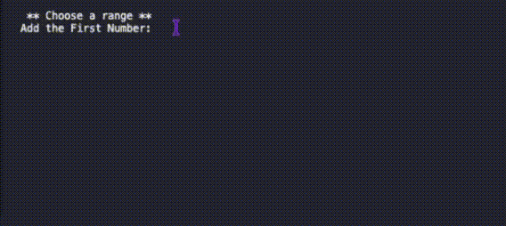

# Number Guessing Games
Number Guessing Games created with Python.

 ## Table of Content 
- [Overview](#overview)
- [View](#view)
- [Process Breakdown](#process-breakdown)
    - [How to Run](#how-to-run)
- [Links](#links)
- [Author](#author)

## Overview

First the user is prompted to choose two numbers, which will be the range of the guessing game. Then the user chooses the number of guesses.
Once the games starts, the user have the set amount of guesses to correctly guess the random random number within the range. If they succeed, a congratulatory message appears, if they run out of guesses, the program print the a message warning they are out of guesses along with the correct number. In both cases, the program terminates once the generated number is printed.

## View

<div align="center">
  
</div>

## Process Breakdown

Starting the project by generating a random number into a integer variable, then another variable is called where the used is asked to guess a number between 1 and 100. 
Once the user type the guess, there is a `if/else` statement where the user guess is compared the generated number. A message will pop-up if it's either too low or too high, and a different one will show if the guess is correct.The entire code is inside a `try` block that prevents the user to type a wrong value, showing a message to the user and restarting the questions. And the `try` is inside a `while` loop that will run the program until the user guess the correct number.

```
while True:
  try:
    # Guessing the number code
    break
  except ValueError:
    print('Please enter a valid number')
```

In this code, there are two enhancements. The first one allows the user to choose the range of the number to be guessed. So instead of a standard 1 to 100 guess, the user have control over the values. These numbers are used to generate a random number within the chosen range, and after that, those same numbers are used in the `if/else` statement for the user guessing.
The second enhancement is to limit the number of guesses the user have. This is also chosen by the user and added into a variable that is called to and called in a `if` statement along with a count variable. Once this number is reached and the user, have not guessed the correct number, the program will notify the user they ran out of guesses, give the correct number and terminate.

### How to Run

Python Version: 3.13.7

```
# Download the code onto a preferred folder.
```
```
# Open the terminal console and navigate to the folder where the file was downloaded.
```
``` 
# (OPTIONAL) Create the Virtual Environment .venv inside the folder where the code is.
python3 -m venv .venv
```
```
# (OPTIONAL) Activate the .venv environment.
source .venv/bin/activate
```
```
# (OPTIONAL) Once activated, you can look for the exact location of the file inside the folder
find . -name 2-number_guessing.py
```
```
# Run the Code
python3 2-number_guessing.py
```

## Links

- [Python for Beginners - Master Problem Solving](https://youtu.be/yVl_G-F7m8c?si=Q8ebGLM_njwdJAww) - Python Tutorial 

## Author

- Developed by Nathalia Santos 🐉<br><br>
[](https://www.linkedin.com/in/naathcs/)