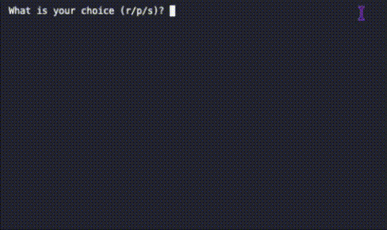

# Rock Paper Scissor
Rock Paper Scissor Game created with Python.

## Table of Content 
- [Overview](#overview)
- [View](#view)
- [Process Breakdown](#process-breakdown)
    - [How to Run](#how-to-run)
- [Links](#links)
- [Author](#author)

## Overview

The program starts with asking the user for their call on the game. There are only three and it can be chosen by the first letter of the each option as shown in the question itself. Once chosen, the computer generates a option to play against the user and print both answer along with a message letting the user know if it was a tie, win or lose.
Then the program asks if the user wants to play again, which the negative answer terminates the program.

## View

<div align="center">
  
</div>

## Process Breakdown

For this program, three constants are created to be used. The three options of the games that will be available to play. A library is created with all the constants, assigned to a variable, and this variable is turned into a tupple to avoid changes by mistake.
Then functions are created to organized the code into blocks. The first function is the to get the user choice on the game, giving the three options of the games. If the user types a capital letter, it will pass through the `lower` method, then it will check if the user input is in the tupple options, and it will either return the choice or a message of an invalid command.
The second function is to print both the user and the computer choices in the games. The parameters added are the varibles used to get the user and computer choices and add them into the code.
The third funcion will check both the user and the computer choices and with a `if` statemente check who is the games of the match. This statement will print a win, lose or tie text for if either of these options happen.

```
if user_choice == computer_choice:
        print('Tie!')
    elif (
        (user_choice == ROCK and computer_choice == SCISSOR) or
        (user_choice == SCISSOR and computer_choice == PAPER) or
        (user_choice == PAPER and computer_choice == ROCK)
    ):
        print('You win!')
    else:
        print('You lose!')
```

The fourth function is used to organized the previous functions in an order that will make sense for the computer to run and the game to work. The function is called `play_game()` and will also bring a `while` loop that will make sure the game keeps running while the user decides to. Also in this function the variables are created and called with a value that will be added to the paramenters of the other functions following the logic. The last section of this function is a question to continue the match with a statemente that will terminate the program if matches the user answer.
Lastly, the program runs by calling the `play_game()` function at the end.

#### How to Run

Python Version: 3.13.7

```
# Download the code onto a preferred folder.
```
```
# Open the terminal console and navigate to the folder where the file was downloaded.
```
``` 
# (OPTIONAL) Create the Virtual Environment .venv inside the folder where the code is.
python3 -m venv .venv
```
```
# (OPTIONAL) Activate the .venv environment.
source .venv/bin/activate
```
```
# (OPTIONAL) Once activated, you can look for the exact location of the file inside the folder
find . -name 3-rock-paper-scissor.py
```
```
# Run the Code
python3 3-rock-paper-scissor.py
```

## Links

- [Python for Beginners - Master Problem Solving](https://youtu.be/yVl_G-F7m8c?si=Q8ebGLM_njwdJAww) - Python Tutorial 

## Author 

- Developed by Nathalia Santos 🐉<br><br>
[](https://www.linkedin.com/in/naathcs/)