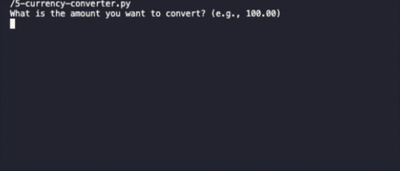

# QR Code Generator
Simple Currency Converter program, using a popular currency library.

## Table of Content 
- [Overview](#overview)
- [View](#view)
- [Process Breakdown](#process-breakdown)
  - [How to Run](#how-to-run)
- [Links](#links)
- [Author](#author)

## Overview

The user is aked to input an amount for the conversion, following the currency they would like to convert the amount `from` and `to`. These three inputs will not let the user continue until there is a valid entry. Once all the three inputs are correct, the program will run and print the convertion rate. Next, a message will appear to ask the user if they would like to run another conversion with a yes/no answer of one silable. Anything other than a `y` or `n`, the program will print a message of '_invalid entry_' and ask the user again until a valid answer is entered.

## View

<div align="center">
  
</div>

## Process Breakdown

The first step was to understand how to use the `CurrencyConverter` library correctly. Once that step was done, three inputs were created to receive the `amount`, the currency to convert `from` and `to`. Once all the values are inputed, the `c.convert()` will receive all those inputs in order for the parameter to run correctly, then print the convertion rate. After the task is complete, a question to check if the user would like to start another convertion task pops up, and the program will either run again or stop.

First, I deciced to separate the inputs and the conversion parameter in two different functions. The first function, will get all the user inputs. and each input request have a `while loop` to avoid a blank or invalid entry from the user. For the variable '*amount*', it started with the `while True` statement, followed byt the `try` statement. Inside,it asks the user to input an amount that will be stored in the variable for conversion. After, an `if` statement will check if the amount is 0, if so, it will print a message and ask the user to input a valid amount. Also sometimes, it is expected the user to type an incorrect entry, such as textx inside a float variable. In this case, it would crash the program with a '*ValueError*' error. To avoid the crash from happening and give the opportunity to the user to input a valid information, the `try/except` statement is triggered, printing and message to let the user know of the invalid amount, and once again to ask for a amount. And this loop will continue until a valid, non zero amount is entered.

Going to the currencies, two variables were created, one for the original currency and one to signal to which currency the amount will be converted to. A text will request the user to input the currency that the amount will be converted **FROM**, then a `while` loop will check if the currency that was inputted, is in the list of valid currencies. If negative, the loop will print a message and ask the user again for a valid currency. Once valid, the code will enter another `while True` loop. This one check two things with a `if` statement, if the entered currency is the same as the previous one, in this case an error message will show up and and ask the user to try again, and if the entered currency is in the list of valid currencies.

It is important to notice that, while the amount variable only accepts float entries, the currency variables will only accept a total of three characters, stripping any spaces. So if numbers, special characters, or anything other than what is expected, the loop will print an error message and ask the user to try again until there is a valid entry. And this will happen with every variable.

Once all variables passed, the function will return the three of them into the next function. The conversion function, will receive all the returned values from the previous one, add all the values into the paramenters. Once converted, this function will print the conversion amount and confirm to which currency it was converted to.

```
# Converting the entered ammount according to the variables' information
conversionResult = c.convert(amount, f'{currencyFrom}', f'{currencyTo}')

# Return the result of the conversion with the conversion input
print(f'Your conversion is: {conversionResult:.2f} {currencyTo}')
```

After all the function ran correctly, there is a last `while True` loop that will run the entire code and, once finished, will ask the user if they would like to run another conversion. This question requires a one character entry, and similar to the other variables, it will print an error message while the user does not input a valid entry. Being a simple _Y/N_ answer, and making sure the answer is not case sensitive, the user needs to type what they would like to do, and based on their answer, the program will either restart, close, or print an error message and ask the same question again.

For this code to work, the imported library `CurrencyConverter` was used.

#### How to Run

Follow this steps if you do not have a virtual envrionment or the necessary libraries to run the code.

Open your terminal and find the folder where the Python file was downloaded, then follow the steps below.

```
# Create a Virtual Environment
python3 -m venv venv
```
```
# Active Virtual Environment
source .venv/bin/activate
```

If not installed already, follow this step
```
# (OPTIONAL) Install Currency Converter library
# If not already installed on you device/virtual environment.
pip3 install currencyconverter
```

```
# Run the Code
python3 5-currency_converter.py
```

## Links

- [Currency Converter Library](https://pypi.org/project/CurrencyConverter/) - Library Downloaded with Currency Historical Rates with the referency currency (Euro). 
- [Currency List](https://currencyapi.net/documentation/currencies/) - Check the list of available currencies for conversion.
- [Limit Character Amount](https://stackoverflow.com/questions/28465779/how-do-i-limit-the-amount-of-letters-in-a-string) - How to limit the amount of characters in a variable.
- [Not In Operator](https://docs.python.org/3/reference/expressions.html) - Section 6.10.2 that talks about the `in` and `not in` operators.
- [Break and Continue Statements](https://docs.python.org/3/reference/simple_stmts.html#the-continue-statement) - `Break` and `Continue` statements to be used on a while loop.
- [Repeating Tasks with While Loop](https://realpython.com/python-while-loop/) - While Loop for repeating tasks until a condition is met.
- [Errors and Exceptions](https://docs.python.org/3/tutorial/errors.html#exceptions) - Handling Exceptions section 8.3 to avoid the program to crash when the user didn't enter a valid input.
- [ValueError Exception](https://realpython.com/ref/builtin-exceptions/valueerror/) - Using Error Exception in a try statement.
## Author 

- Developed by Nathalia Santos 🐉<br><br>
[](https://www.linkedin.com/in/naathcs/)