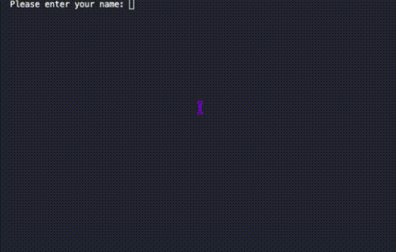

# Quiz Game
A small pop quiz game with multiple choice answers and score counting.

## Table of Content 
- [Overview](#overview)
- [View](#view)
- [Process Breakdown](#process-breakdown)
  - [How to Run](#how-to-run)
- [Links](#links)
- [Author](#author)

## Overview

The games is designed with 5 random questions and 4 options of answer for each question. 
The goal of the quiz is that, each time the program runs, five random questions will show up to the user, one at a time, and the options to answer will also be shown. The user can then type their guess, and if they type an invalid answer the program will flag and ask the question again. Once a valid answer is inputted, the program will move on until all the questions are answered. 
At the end, the score will be shown and a question to wheather the user would like to play again, and the answer will either run the program again or terminate it.

## View

<div align="center">
  
</div>

## Process Breakdown

Started by creating a `JSON` file with the questions that will be used in the quiz game. The questions are supposed to be general knowledge, used only for the fun of a simple quiz game.

The code starts by importing the libraries `json` and `random`, that will be used in the code for the main goals of importing a JSON file into the code to be used in the game, and to randomly select a item from said JSON file and print it on screen fot the user, respectively.

After the libraries, the JSON file is imported into the code and assigned into a variable so it can be used later. The import is using a relative path to find the file that is in the same folder as the code itself. Then the global variables are added, these are the variables that will be used in different functions withing the code so the game can work with the same data in different stages of the game.

THe first function in the code is the starting of the game where it asks for the name of the user. Initially, this information was going to be ignored for the rest of the code, but at the final version, the name is used to show the user guesses at the end.

The second function in the code is used to get the user gueess into a variable `user_guess`. This variable will be used to check if the answer is correct or not, and to store the guesses to be printed at the end of the game. This variable input used the `strip()` and the `upper()` methods. The _strip()_ method is used to remove any extra space that the user might have added, and the _upper()_ method will turn any entered character to a capital letter. At the end of both methods, the `[:1]` is added to limit the amount of characters in the variable to _1_. So if the user adds more the one character, only the first character will be stored. Still in the same function, there is an **if statement** that will check this character. If the user option is out of the four option characters, a error message will show up and ask the user to try again, and the answer will only be stored and the program will move to the next question if the answer pass the **if statement**. 

The next function is the `check_answer()` that will get the user inputs from the previous function and check it. Starting bu getting the `score` function and turning it global to make sure the score count can be later used. Then get the **user_input()** function and add assign it to a variable. The next step is to create three variables, the first variable being `correct_answer` to get an specific variable from the JSON file and store it, then a second variable being `answer_index` that will read throught the options for answer and store the one that matches the `correct_answer` index, The third variable is `correct_letter`, this one will read throught the options index and find the one that matches the `answer_index`, then will strip the option letter from any unnecessary additions, them being spaces, punctuations, etc., making it a clean variable.

```
# get the correct answer to verify the user's answer
correct_answer = current_question['correctAnswer']

# Find the location of the answer in the array
answer_index = current_question['options'].index(correct_answer)

# clean variable
correct_letter = opts[answer_index].strip().rstrip('.') 
```

The following variable will store all the correct answers, that will be later used to match the user's guesses.

After the variables are created and correctly assigned, there is an **if statement** that will check the user's guess for each question. The **if statement** will check if the user guess matches the variable containing the `correct_letter` answer. If the guess matches the correct answer, a 'correct' message will show up to the user, and the score variable that was called in the beginning of the function will be incremented by 1. If the answer is incorrect, a message saying so will show up to the user along with the correct answer. 

The next function is the one containing the logic to call the question in a random order and show up to the user. The `current_question` is called globally in this function because it is being used in the **check_answer()** function and it needs the information gathered from the question generation logic to find the correct answer. Then a question number variable is started to use as aesthetics when the questions show up. Using the **random.sample()** function with the variable to where the JSON file was assigned to, this way 5 random questions will be printed, and as long as the questions are not repeating in the JSON file, they should not repeat when printed in the game. 

```
# Getting a limit of 5 random questions from the json file
  selected_questions = random.sample(quiz_data, min(5, len(quiz_data)))
```

After the randomization is assigned to a variable, a **for loop** is created where it will print the question to the user in a visual and understandable format, by printing the question number followed by the question, then incrementing the `questionNumber` variable. After the question, a similar approach is taken for the response options of the question. A `loc` variable is started at the index 0 to find the location of all the options, the it will print the options by location (`loc`), with the _opts_ that will print each option in a letter location from A to D. All inside the **for loop**. At the end of the function the **check_answer()** is called so it is ran at the end of each question.

Another function is the **user_score()** that is where the user's guesses and correct answers are printed so the user can check their answers. Also, it is where the score variable is used to calculate the user score at the end of the quiz game. The score uses a calculation multiplied by 100, so when it is printed at the end, it is in a percentage format.

```
finalScore = int((score / total_questions) * 100)
```

A last function is created to run all the previous functions in the correct order for the quiz game for work. These function are added inside a **while loop**, so at the end of the quiz game, the user is asked if theyu would like to play again. The answer being a one character for Yes or No, and anything different than one of these answer triggering an error message and asking the user again until a valid answer is inputed.


### How to Run

Follow this steps if you do not have a virtual envrionment to run the code.

Download the folder `6-quiz-game` with both the `6-quiz-game.py` and the `questions.json` files.

Open your terminal and find the where the `6-quiz-game` folder was downloaded, then follow the steps below.

```
# Create a Virtual Environment
python3 -m venv venv
```
```
# Active Virtual Environment
source .venv/bin/activate
```
```
# Run the Code
python3 6-quiz-game.py
```

## Links

- [Create a Quiz Games with Python](https://www.youtube.com/watch?v=zehwgTB0vV8) - Reference video used for a couple lines of code and the general structure of the project.
- [JSON Files](https://www.youtube.com/watch?v=iiADhChRriM&t=170s) - Creating a JSON file.
- [Generate Randoms](https://docs.python.org/3/library/random.html) - Generate pseudo-random number for various distributions.
- [Fixing JSON Call Error](https://stackoverflow.com/questions/22282760/filenotfounderror-errno-2-no-such-file-or-directory) - Understanding what triggered the error when trying to call the JSON file into the code.
- [Multi-level Nested JSON](https://medium.com/@ferzia_firdousi/multi-level-nested-json-82d29dd9528) - Nesting information in JSON file
- [Random Sampling](https://note.nkmk.me/en/python-random-choice-sample-choices/) - Understanding the usage of `random.choice()`
- [Simple Statements](https://docs.python.org/3/reference/simple_stmts.html) - Understand why functions need explicit return values to pass data back.

## Author 

- Developed by Nathalia Santos 🐉<br><br>
[](https://www.linkedin.com/in/naathcs/)