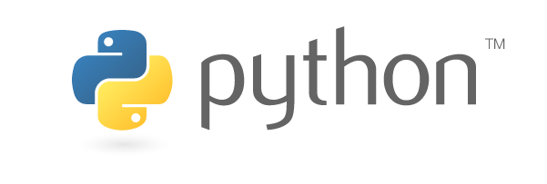

# Python Projects
A collection of small Python projects.

## Table of Contents
  - [Overview](#overview)
  - [Views](#views)
  - [About](#about)
  - [Tutorial Source](#tutorial-source)
    - [Links](#links)
  - [Author](#author)

## Overview

This folder contains several small Python projects. The difficulty of almost every project in this folder is `easy` and the goal is to practice day-to-day coding to maintain the Critical Thinking and Problem-Solving skills when using development languanges.
This folder is going to be updated gradually and will contain Python focused projects using different libraries.
The projects will be from different sources and as the projects are being added to the this folder, the source will be mentioned as well.

## Views

  

## About

This folder contains subfolders with the Python projects, where each project contain a `README` file explaining about the program and how to run.
These are all beginner level programming tasks to practice problem-solving skills and logic.

## Tutorial Source

### Links

There are currently no extra links used for the creating process of these projects.

### Libraries

- [QR Code Library](https://pypi.org/project/qrcode/) - Library used for the QR Code Generator Project

## Author

- Developed by Nathalia Santos 🐉  

